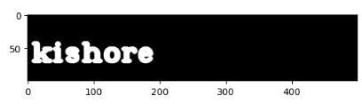
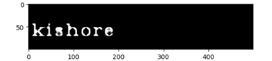
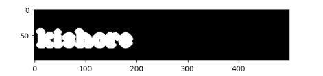

# Implementation-of-Erosion-and-Dilation
## Aim
To implement Erosion and Dilation using Python and OpenCV.
## Software Required
1. Anaconda - Python 3.7
2. OpenCV
## Algorithm:
### Step1:
Import the necessary packages.

### Step2:
Create the Text using cv2.putText.

### Step3:
Create the structuring element.

### Step4:
Erode and Dilate the image.

### Step5:
End Program.
 
## Program:
Developed By: Kishore kumar s

Reg No: 212221240023


# Import the necessary packages
```
import cv2
import numpy as np
import matplotlib.pyplot as plt
```

# Load the image
```
img1=np.zeros((100,500),dtype='uint8')
font=cv2.FONT_HERSHEY_COMPLEX_SMALL
```

 
# Create the Text using cv2.putText
```
cv2.putText(img1,' PRASHE ',(5,70),font,2,(255),5,cv2.LINE_AA)
plt.imshow(img1,cmap='gray')
```

 
# Create the structuring element
```
kernel1=cv2.getStructuringElement(cv2.MORPH_CROSS,(7,7))
```

 
# Erode the image
```
img_erode=cv2.erode(img1,kernel1)
plt.imshow(img_erode,cmap='gray')
```

 
# Dilate the image
```
img_dilate=cv2.dilate(img1,kernel1)
plt.imshow(img_dilate,cmap='gray')

```


## Output:

### Display the input Image


### Display the Eroded Image


### Display the Dilated Image


## Result
Thus the generated text image is eroded and dilated using python and OpenCV.